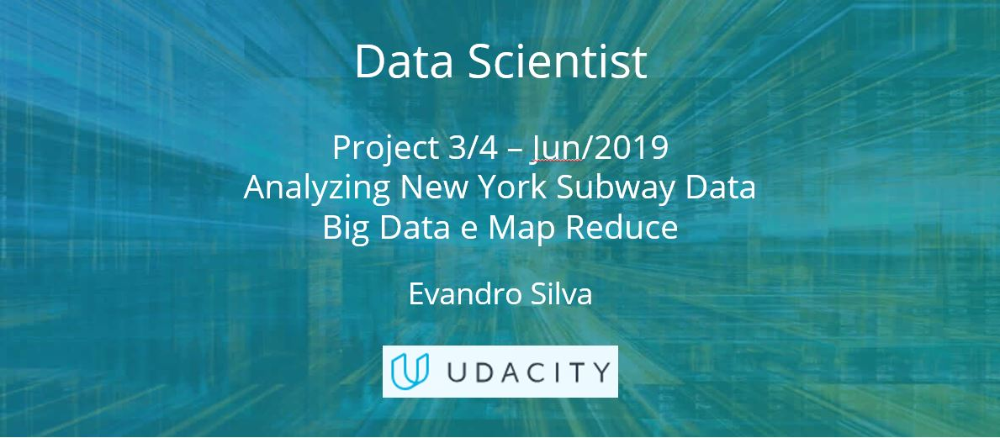

## Nanodegree - Data Scientist - Project 3 of 4 (UDACITY)

### Project/Business Purpose: 
- Def_Proj - xx.pdf

### Entrega: 
- Report - xx.html
- xx.ipynb

### Avaliação do cliente:
 - xx.pdf
 
 

## Analyzing New York Subway Data
### Project Overview

In this project you will apply all the knowledge acquired in this first month of course, with basic tasks of data acquisition and cleaning. In the process we will discover essential information about the data using what was learned in the statistics course.

### Project Highlights

The purpose of this project is to explore the relationship between the data from the New York subway turnstiles and the weather on the day of collection. For this, in addition to the subway data, we will need the weather data for New York City.

The main points that will be verified in this work:

- Internet Data Collection
- Use of statistics for data analysis
- Data manipulation and simple graphing with Pandas

